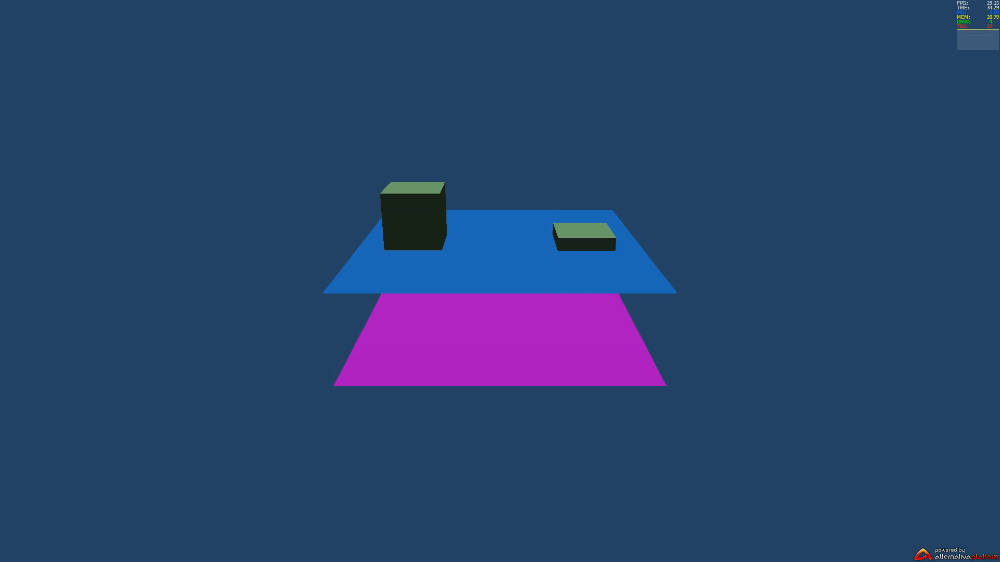
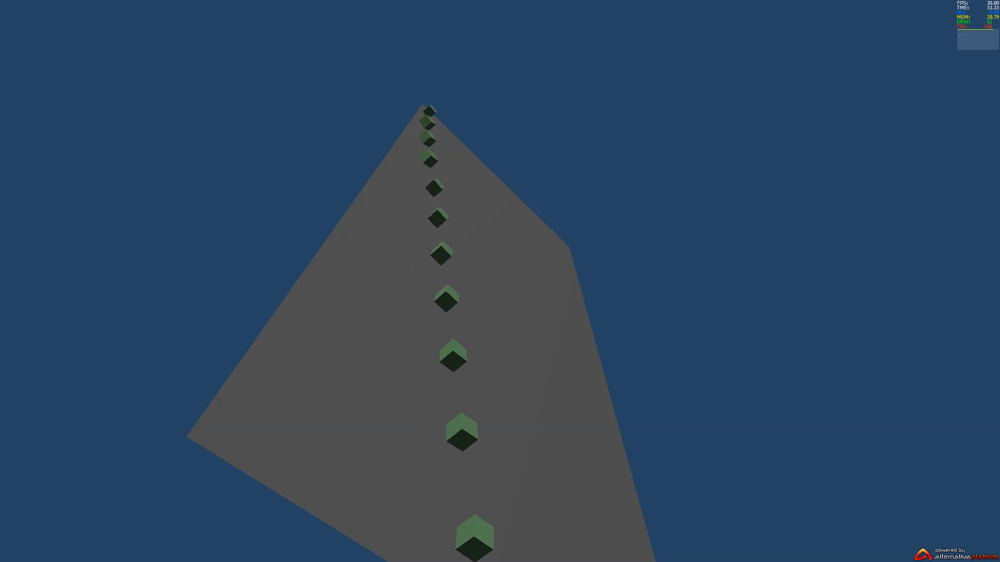
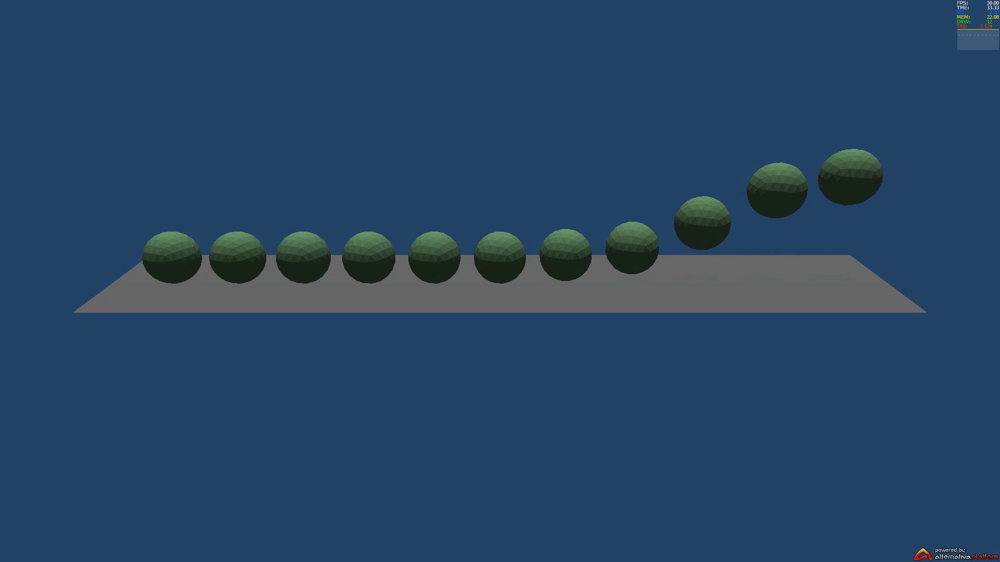
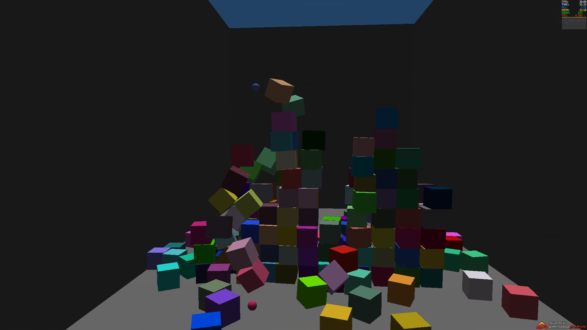
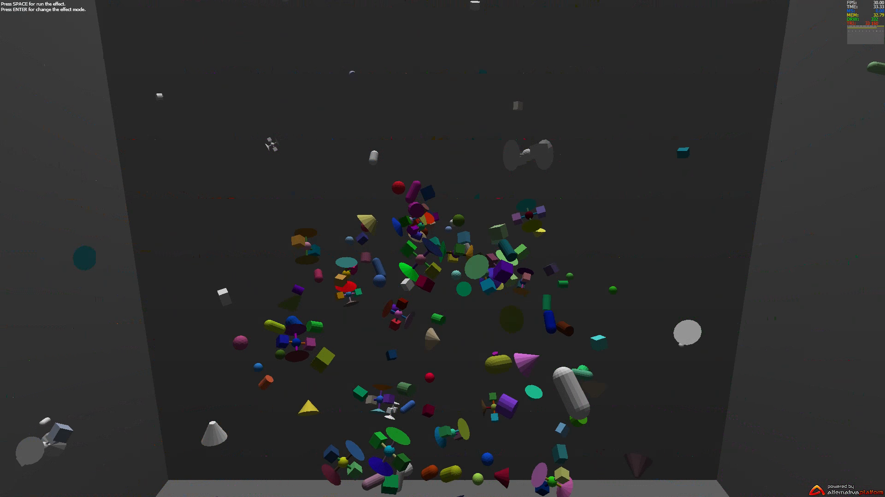
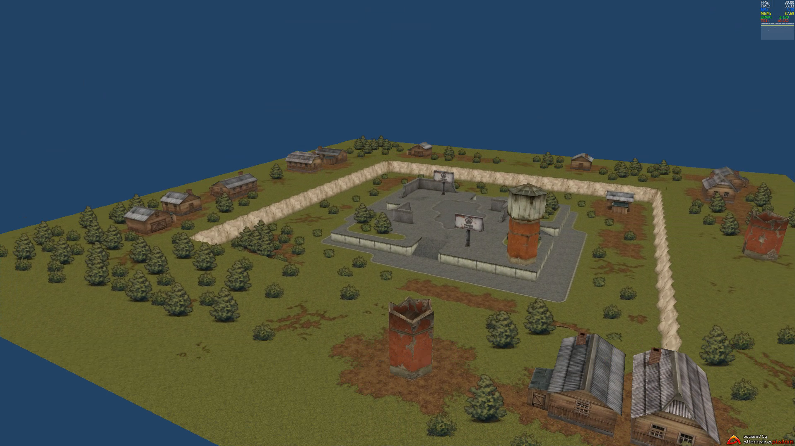

# a3d_helper

In inc/Alternativa3D-8.32.0.swc added alternativa.engine3d.objects.Terrain class (created by redefy) and few primitives in alternativa.engine3d.primitives package (created by redefy).
 
[Powered by AlternativaPlatform](http://www.alternativaplatform.com/)
